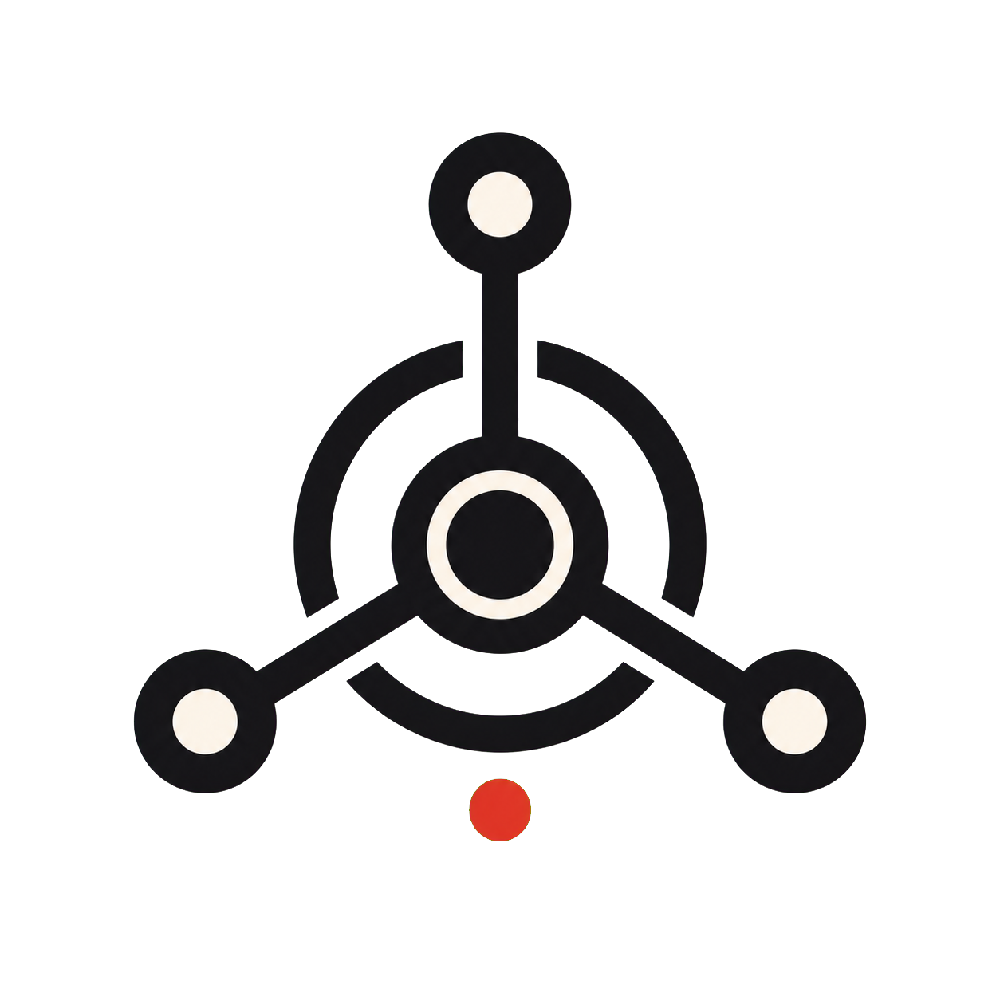
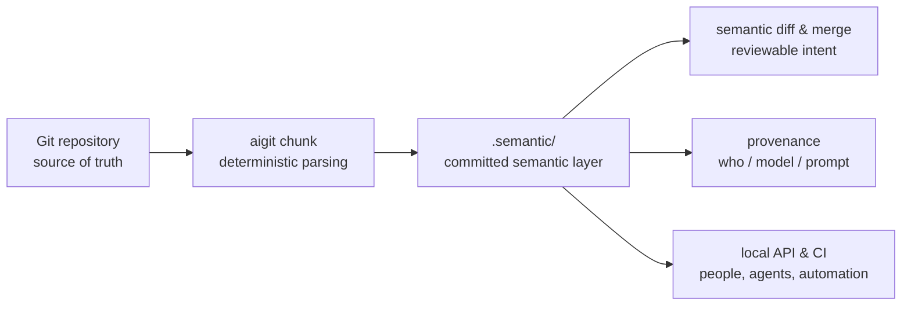
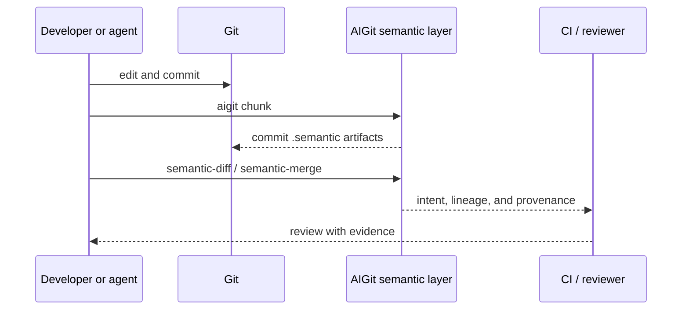

# AIGit

<p align="center">
  
</p>

[](https://github.com/jesusvilela/aigit/actions/workflows/ci.yml)
[](https://github.com/jesusvilela/aigit/actions/workflows/semantic-maintenance.yml)
[](LICENSE)

> **Git for files. AIGit for intent.**

AI-native semantic version control that gives people, agents, and CI a shared, deterministic view of what a change *means*.

**Alpha software.** The semantic core is usable today; parser coverage and workflow ergonomics are actively evolving. Bring it to a real repository, inspect the output, and help shape the contract.

<br>

```text
静けさ — clarity before automation
```

## Why this exists

Code is no longer changed only by people. Agents can move quickly, but a line diff alone cannot answer the questions a team actually has:

- What capability changed?
- Did this refactor preserve its identity?
- Which agent produced this change, from which prompt and model?
- Where is the real merge risk?

AIGit keeps Git exactly as it is and adds a committed semantic layer beside it. No custom object store. No platform lock-in. No magic state that only one tool can read.

| You need | AIGit gives you | So you can |
| --- | --- | --- |
| review beyond line movement | deterministic semantic chunks and diffs | see intent-level change in pull requests |
| maintain context through refactors | stable IDs and lineage edges | trace a concept as it moves or changes shape |
| use agents responsibly | append-only provenance and commit trailers | audit generated work without guessing |
| merge agent work with confidence | semantic merge reports | surface conflict risk before the merge button |
| automate without surrendering control | a local API, CI checks, and an optional operator UI | keep humans in the loop |

## The quiet architecture



The contract is intentionally small:

- Git remains the source of truth.
- Semantic outputs live in `.semantic/` and can be committed, reviewed, and regenerated.
- Normal GitHub and GitLab workflows continue to work.
- If AIGit is removed, the repository remains a normal Git repository.

## Start in three breaths

Prerequisite: Python 3.10+ and Git. `uv` is the preferred environment manager; `pip` works too.

```bash
git clone https://github.com/jesusvilela/aigit.git
cd aigit
./scripts/bootstrap_uv.sh
uv run aigit chunk
```

Then ask a useful question of your repository:

```bash
# What changed in meaning between two refs?
uv run aigit semantic-diff --base main --head HEAD --output semantic_diff.md

# Where might two concurrent changes collide?
uv run aigit semantic-merge --base main --ours HEAD --theirs feature --output semantic_merge.json
```

<details>
<summary>Prefer pip?</summary>

```bash
python -m pip install -e ".[dev]"
aigit chunk
```

</details>

## A practical loop



For AI-assisted commits, attach the work context as you create the commit:

```bash
aigit commit -m "refactor parser" \
  --agent codex \
  --model gpt-5.2-codex \
  --prompt "extract parser helpers while preserving behavior"
```

## What is ready now

| Surface | Available today |
| --- | --- |
| Semantic core | deterministic chunking for Python, Markdown, JSON, YAML, TypeScript, and a safe file fallback |
| Identity and lineage | stable semantic IDs, conservative lineage edges, `chunk_index.json` |
| Review tooling | semantic diff and semantic merge reports |
| Provenance | append-only provenance log, signed records, commit trailers |
| Agent access | local HTTP API through `aigit serve-api` |
| Team automation | semantic freshness checks and PR-based maintenance workflow |
| Operator mode | optional DeerFlow harness and Gradio admin UI |

## Command map

| Command | Use it when |
| --- | --- |
| `aigit chunk` | you need to rebuild semantic state |
| `aigit semantic-diff --base <ref> --head <ref>` | you want an intent-focused comparison |
| `aigit semantic-merge --base <ref> --ours <ref> --theirs <ref>` | you need early merge-risk signals |
| `aigit record-provenance --agent … --model … --prompt …` | you need an auditable record of AI context |
| `aigit commit -m <message> --agent … --model … --prompt …` | you want provenance attached to a commit |
| `aigit serve-api` | an agent or tool needs semantic context locally |
| `aigit improve` | you want a concise local chunk-and-test cycle |
| `aigit subagent-scout` | you need a quick repository diagnosis |
| `aigit up` | you are running the optional DeerFlow operator stack |

Run `aigit --help` for the full command reference.

## Install profiles

| Install | Includes |
| --- | --- |
| `pip install aigit` | pure-stdlib semantic core, diff/merge, provenance, and local API |
| `pip install "aigit[ui]"` | the Gradio observability UI (`aigit admin-ui`) |
| `pip install "aigit[dev]"` | test dependencies |
| `aigit[deerflow]` + Docker | optional DeerFlow harness; requires a DeerFlow checkout at runtime |

## The committed layer

```text
.semantic/
  schema_version       # reproducibility contract
  ruleset.yaml         # parser and ruleset settings
  manifest.jsonl       # semantic chunks
  edges.jsonl          # identity and lineage links
  chunk_index.json     # fast lookup
  provenance.jsonl     # append-only AI work record
  cache/                # local-only, ignored by Git
```

## Community: build the contract with us

This project needs skeptical builders: people who review AI-generated changes, maintain developer tools, build coding agents, or care about durable software history.

Good first contributions are deliberately small:

1. Try `aigit chunk` on a repository you know well.
2. Open an issue with a confusing chunk, missed lineage link, or workflow friction.
3. Pick a documented roadmap item, parser improvement, test, or documentation fix.
4. Send a focused pull request.

Please read [Contributing](CONTRIBUTING.md), our [Code of Conduct](CODE_OF_CONDUCT.md), and [Security policy](SECURITY.md) before participating. We are especially interested in real-world examples where semantic context would make review safer or faster.

## For maintainers and operators

The optional DeerFlow stack is for long-running autonomous delivery with visibility and recovery controls. It is not required for the semantic core.

```bash
cp .deerflow/.env.example .deerflow/.env
aigit up
aigit admin-ui --host 127.0.0.1 --port 7860
```

Useful references:

- [Release governance](docs/RELEASE_GOVERNANCE.md)
- [Roadmap](docs/EPICS_ROADMAP.md)
- [DeerFlow recovery playbook](docs/DEERFLOW_RECOVERY.md)
- [Cycle 2 release charter](docs/CYCLE_02_10X_RELEASE.md)
- [Custom DeerFlow autopilot skill](skills/custom/deerflow-aigit-autopilot/SKILL.md)

## Verify a checkout

```bash
uv sync --extra dev
pytest -q
./scripts/ci_refresh_semantics.sh
git diff --exit-code -- .semantic
```

The CI matrix tests Python 3.10–3.12, validates the lockfile, and rejects stale committed semantic artifacts.

## License

Apache-2.0. See [LICENSE](LICENSE).

## Brand

The AIGit mark and its usage guidance live in [Brand guidelines](docs/BRAND.md). The transparent PNG is ready for social posts, presentations, and repository use.
