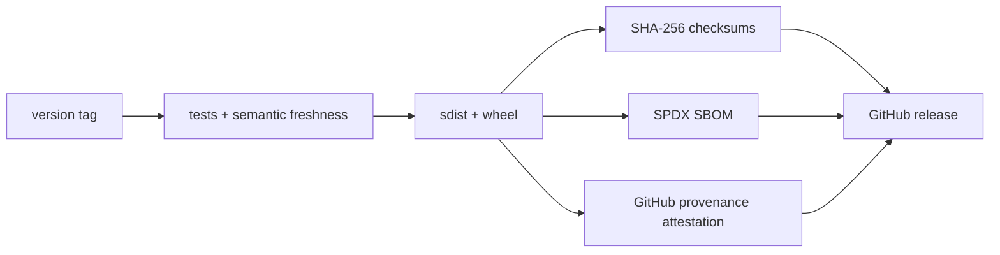

# Beta readiness

Beta is the point at which a team can adopt AIGit in a real repository with predictable behavior, clear recovery paths, and a verifiable release trail. It does **not** mean every roadmap epic is complete.

## Exit gates

| Gate | Evidence | Status |
| --- | --- | --- |
| Deterministic core | same snapshot and ruleset reproduce byte-identical `.semantic/` output | automated in CI |
| Supported platforms | Python 3.10, 3.11, and 3.12 tests pass | automated in CI |
| Installability | a built wheel installs and exposes `aigit --help` outside the checkout | automated in CI |
| Release integrity | source distribution, wheel, SHA-256 checksums, SPDX SBOM, and GitHub provenance attestation | automated on version tags |
| Change communication | changelog, release notes, schema/ruleset compatibility notes | maintained per release |
| Recovery | documented DeerFlow and semantic-state recovery path | documented |
| Development record | public journal records decisions, evidence, reversals, and open questions | started |
| Confirmatory evidence | beta claims have a locked preregistration and published result summary | beta-core plan proposed |
| Adoption proof | at least three non-trivial external repositories report successful use | needs community evidence |
| Parser confidence | fixtures cover representative Python, Markdown, JSON, YAML, and TypeScript edge cases | needs beta test matrix |
| Security posture | private reporting route, dependency updates, and branch protection | partial: repository settings required |

## Release artifacts

Every `v<package-version>` tag creates:



Download the release assets from GitHub, verify checksums with `sha256sum -c SHA256SUMS`, and verify provenance with:

```bash
gh attestation verify aigit-<version>-py3-none-any.whl -R jesusvilela/aigit
```

## Recommended beta sequence

1. Keep the [development journal](DEVELOPMENT_JOURNAL.md) current as public-alpha work proceeds.
2. Lock the [beta-core preregistration](prereg/2026-07-beta-core.md) after design-partner fixtures are selected.
3. Recruit three design partners and collect their chunking, refactor, and merge examples.
4. Turn those examples into a versioned parser/lineage regression matrix and publish results.
5. Tag `v0.2.0b1` when the matrix, docs, and adoption proof are ready.
6. Cut further beta tags only from green CI; explain semantic schema or ruleset changes in each release.

## One-time GitHub settings

Repository files cannot enforce these settings. Configure them in GitHub before inviting beta users:

- Require CI, semantic freshness, and package jobs before merging to `main`.
- Require pull requests and at least one approving review for `main`.
- Enable private vulnerability reporting.
- Enable GitHub Actions artifact attestations if your repository plan requires an opt-in.
- If publishing to PyPI, configure a PyPI Trusted Publisher for the `Release` workflow; do not add a long-lived API token.
